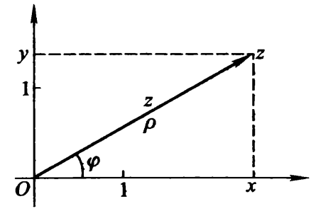

# 复变函数

## 复变函数

### 复数

复数可以表示为实数和纯虚数的和

代数式：
$$
z=x+\mathrm{i}y
$$

- x：实部，记为Re z
- y：虚部，记为Im z

复平面：

极坐标下
$$
\begin{cases}
	\rho=\sqrt{x^2+y^2} \\
	\varphi=\arctan (y/x)
\end{cases}
$$

$$
\begin{cases}
	x=\rho \cos \varphi  \\
	y=\rho \sin \varphi
\end{cases}
$$

于是复数可以表示为三角式
$$
z=\rho (\cos \varphi+ \mathrm{i}\sin \varphi )=\rho e^{\mathrm{i}\varphi}
$$

- $\rho$：模，记为$|z|$
- $\varphi$：辐角，记为Arg z

- 复数的辐角有无穷多个，彼此间差$2k\pi$，于是我们约定在$[0,2\pi)$的辐角为主辐角

- 复数**零**的辐角没有意义

#### 复数的运算

加减（满足交换律、结合律）
$$
z_1\pm z_2=(x_1 \pm x_2)+\mathrm{i}(y_1\pm y_2)
$$
乘（满足交换律、结合律、分配律）
$$
z_1z_2=(x_1x_2-y_1y_2)+\mathrm{i}(x_1y_2-x_2y_1)
$$

$$
z_1z_2=\rho_1 \rho_2 e^{\mathrm{i}(\varphi_1+\varphi_2)}
$$

除（是乘的逆运算）
$$
\frac{z_1}{z_2}=\frac{x_1x_2+y_1y_2}{x_2^2+y_2^2}+\mathrm{i}\frac{x_2y_1+x_1y_2}{x_2^2+y_2^2}
$$

$$
\frac{z_1}{z_2}=\frac{\rho_1}{\rho_2} e^{\mathrm{i}(\varphi_1-\varphi_2)}
$$

n次幂
$$
z^n=\rho^n e^{\mathrm{i}n\varphi}
$$
n次根式
$$
\sqrt[n]{z}=\sqrt[n]{\rho}\ e^{\mathrm{i}\frac{\varphi}{n}}
$$

### 复变函数

$$
\omega=f(z)
$$

- z为$\omega$的宗量，$z\in E$

#### 区域

在解析函数论中，函数的定义域不是一般的点集，而是满足一定条件的点击，称为区域，用B表示

- 邻域：以复数$z_0$为圆心，画一个半径为任意小正实数的圆，圆内所有点被称为$z_0$的邻域
- 内点：若某点及其邻域都属于点集E，那么该点是点集E的内点
- 外点：若某点及其邻域都不属于点集E，那么该点是点集E的外点
- 边界点：若某点及其邻域既有属于点集E的点，也有不属于的点，那么该点是点集E的边界点
- 边界线：全体边界点构成边界线

区域是满足以下两条件的点集

- 全由内点组成
- 具有连通性，点集内任意两点都联通，且路径上的点都在该点集

闭区域：区域+边境线组成的点集

#### 连续

$$
当z\rightarrow z_0时，f(z)\rightarrow f(z_0)
$$

### 导数

实变数$\Delta x$只能沿着实轴趋近0，但复变数$\Delta z$可以沿着复平面上任意一曲线逼近0

若极限
$$
\lim _{\Delta z \rightarrow 0}\frac{f(z+\Delta z)-f(z)}{\Delta z}
$$
存在，且与$\Delta z \rightarrow 0$的方式无关，则称函数$\omega=f(z)$在$z$点可导（也称单演），这个极限被称为函数在该点的导数（也叫微商）

- 若$\Delta z$沿着平行于实轴方向逼近0，$\Delta y \equiv 0,\Delta z=\Delta x \rightarrow 0$

$$
\lim _{\Delta z \rightarrow 0}\frac{\Delta\omega}{\Delta z}=\frac{\partial v}{\partial x}+\mathrm{i}\frac{\partial u}{\partial x}
$$

- 若$\Delta z$沿着平行于虚轴方向逼近0，$\Delta x \equiv 0,\Delta z=\mathrm{i}\Delta y \rightarrow 0$

$$
\lim _{\Delta z \rightarrow 0}\frac{\Delta\omega}{\Delta z}=\frac{\partial v}{\partial y}-\mathrm{i}\frac{\partial u}{\partial y}
$$

要想让在该点可导，这两个极限必须同时存在且相等，于是
$$
\begin{cases}
	\frac{\partial u}{\partial x}=\frac{\partial v}{\partial y} \\
	\frac{\partial v}{\partial x}=-\frac{\partial u}{\partial y}
\end{cases}
$$
这个方程被称为**柯西-黎曼方程**，或者**柯西-黎曼条件（C-R条件）**，这个方程是复变函数可导的**必要条件**

充要条件为：函数的偏导存在且连续，且满足C-R条件

### 解析函数

若函数$f(z)$在点$z_0$及其邻域上处处可导，则称$f(z)$在$z_0$点**解析**

若$f(z)$在区域B上处处解析，那么称$f(z)$是区域B上的解析函数

解析函数是一类具有特殊性质的复变函数

#### 正交性

若函数$f(z)=u+\mathrm{i}v$在区域B上解析，则
$$
u(x,y)=C_1,v(x,y)=C_2
$$
是B上的两组正交曲线族，即梯度$\nabla u$（其直角坐标分量为$\frac{\partial u}{\partial x}$和$\frac{\partial u}{\partial y}$）与梯度$\nabla v$（其直角坐标分量为$\frac{\partial v}{\partial x}$和$\frac{\partial v}{\partial y}$）正交

#### 调和函数

若函数$f(z)=u+\mathrm{i}v$在区域B上解析，则$u,v$均为B上的**调和函数**

- 若函数$H(x,y)$存在二阶连续偏导数，且满足拉普拉斯方程$\nabla^2H=0$，则该函数为调和函数

#### 应用

给定一个二元的调和函数，将其看作某个解析函数的实部，利用C-R条件求出对应的虚部，于是就构建了一个解析函数

- 曲线积分法
- 凑全微分显式法
- 不定积分法

### 多值函数

根式函数、对数函数就是一种多值函数

黎曼面

## 傅里叶变换

### 傅里叶级数

我们已经学过，周期函数可以唯一展开为以三角函数为基本函数族的级数

这些三角函数满足任意两个函数的乘积在一个周期内的积分为0，即正交性

利用三角函数的正交性，我们求出展开系数，这个系数被称为傅里叶系数

这个三角函数族是**完备**的

- 完备的充要条件：任意一平方可积函数的傅里叶级数均值收敛于它本身

#### 傅里叶级数收敛定理

若一周期函数$f(x)$满足**狄里希利条件**，则函数的傅里叶级数收敛（也就是函数可以用傅里叶级数表示），且收敛值为

- 当$x$是$f(x)$的连续点时，级数收敛于$f(x)$
- 当$x$是$f(x)$的间断点时，级数收敛于$\frac{1}{2}[f(x-0)+f(x+0)]$

#### 傅里叶级数的复数表示

$$
\sum^{\infty}_{n=-\infty}c_ne^{\mathrm{i}\frac{n\pi x}{l}}
$$

$$
c_n=\frac{1}{2l}\int^l_{-l}f(x)e^{-\mathrm{i}\frac{n\pi x}{l}}\mathrm{d}x
$$

### 傅里叶积分

一般来说非周期函数不能展开为傅里叶级数，但是如果我们将这个函数视为周期趋近于无穷的函数
$$
f(x)=\int_0^{\infty}A(\omega)\cos \omega \mathrm{d}\omega+\int_0^{\infty}B(\omega)\sin \omega \mathrm{d}\omega
$$
其中
$$
A(\omega)=\frac{1}{\pi}\int^{\infty}_{-\infty}f(\xi)\cos \omega\xi\mathrm{d}\xi
$$

$$
B(\omega)=\frac{1}{\pi}\int^{\infty}_{-\infty}f(\xi)\sin \omega\xi\mathrm{d}\xi
$$

上面的公式是**傅里叶积分**，这两个参数函数称为**傅里叶变换式**

#### 傅里叶积分定理

若函数$f(x)$在区间$(-\infty,\infty)$满足

- $f(x)$在任意一有限区间内满足**狄里希利条件**
- 在$(-\infty,\infty)$绝对可积（即$\int^{\infty}_{-\infty}|f(x)|\mathrm{d}x$收敛）

则$f(x)$可以用傅里叶积分表示，且积分值为$\frac{1}{2}[f(x-0)+f(x+0)]$

#### 傅里叶积分的复数表示

$$
f(x)=\int^{\infty}_{-\infty}F(\omega)e^{\mathrm{i}\omega x}\mathrm{d}\omega
=\frac{1}{\sqrt{2\pi}}\int^{\infty}_{-\infty}F(\omega)e^{\mathrm{i}\omega x}\mathrm{d}\omega
$$

$$
F(\omega)=
\begin{cases}
\frac{1}{2}[A(\omega)-\mathrm{i}B(\omega)] & (\omega\ge 0) \\
\frac{1}{2}[A(|\omega|)+\mathrm{i}B(|\omega|)] & (\omega< 0)
\end{cases}
$$

$$
F(\omega)=\frac{1}{\sqrt{2\pi}}\int^{\infty}_{-\infty}f(x)[e^{\mathrm{i}\omega x}]^{*}\mathrm{d}\omega
$$

- 这里的$[]^*$是复数的共轭的意思，实际上就是直接给虚部加一个符号

我们称$f(x)$为**原函数**，$F(\omega)$为**像函数**

##### 例题

求矩阵脉冲函数$f(t)=h \ rect (t/2T)$的傅里叶变换
$$
\mathscr F[h \ rect (t/2T)]
=\frac{1}{\sqrt{2\pi}}\int^{\infty}_{-\infty}h \ rect (t/2T)e^{-\mathrm{i}\omega t}\mathrm{d}t \\
=\frac{h}{2\pi}\int^{T}_{-T}e^{-\mathrm{i}\omega t}\mathrm{d}t \\
=-\frac{h}{2\pi \mathrm{i}\omega}e^{-\mathrm{i}\omega t}|^{T}_{-T} \\
=\frac{h}{\pi}\frac{\sin \omega T}{\omega}
$$

#### 傅里叶变化的基本性质

导数定理
$$
\mathscr F[f'(x)]=\mathrm{i}\omega F(\omega)
$$
积分定理
$$
\mathscr F[\int^{(x)}f(\xi)\mathrm{d}\xi]=\frac{1}{\mathrm{i}\omega} F(\omega)
$$
相似性定理
$$
\mathscr F[f(ax)]=\frac{1}{a} F(\frac{\omega}{a})
$$
延迟定理
$$
\mathscr F[f(x-x_0)]=e^{-\mathrm{i}\omega x_0} F(\omega)
$$
位移定理
$$
\mathscr F[e^{\mathrm{i}\omega_0 x} f(x)]=f(\omega-\omega_0)
$$
卷积定理
$$
\mathscr F[f_1(x)*f_2(x)]=2\pi F_1(\omega)F_2(\omega)
$$

## 拉普拉斯变换

### 拉普拉斯变换

傅里叶积分和傅里叶变换存在的条件是原函数在任意一有限区间满足狄里希利条件，且在$(-\infty,\infty)$上绝对可积，这实际上是一个相当苛刻的条件，导致很多常见函数都不满足

而拉普拉斯变换是一种条件更宽泛的变换

拉普拉斯变换常用于初始值问题，即知道某个物理量在初始时刻$t=0$的值$f(0)$，求一段时刻后的情况$f(t)$

我们置$f(t)=0$，构造一个函数$g(t)$，使得

$$
g(t)=e^{-\sigma t}f(t)
$$

- 其中$e^{-\sigma t}$为收敛因子，正实数$\sigma$取特别大，以保证$g(t)$在$(-\infty,\infty)$绝对可积

于是我们对$g(t)$进行傅里叶变换，得到
$$
G(\omega)=\frac{1}{2\pi}\int^{\infty}_{0}f(t)e^{-(\sigma +\mathrm{i}\omega )t}\mathrm{d}t
$$
令$p=\sigma +\mathrm{i}\omega$，$G(\omega)=\overline{f}(p)/2\pi$，则
$$
\mathscr L[f(t)]=\overline{f}(p)=\int^{\infty}_{0}f(t)e^{-pt}\mathrm{d}t
$$
我们称这个积分为**拉普拉斯积分**，而函数$\overline{f}(p)$为$f(t)$的**拉普拉斯变换函数**，这个变化过程称为拉普拉斯变换，$e^{pt}$称为**核**

#### 变换条件

- 在$[0,\infty)$的任意有限区间上，除了有限个第一类间断点外，函数及其导数是处处连续的
- 存在常数$M>0$，$\sigma \ge0$，使得对任意$t\in [0,\infty)$有

$$
|f(t)|<Me^{\sigma t}
$$

其中$\sigma$的下界称为**收敛横标**，记为$\sigma_0$

在实际应用中，大部分函数都满足这个条件

#### 性质

- $\overline{f}(p)$是$Re p=\sigma > \sigma_0$的半平面上的解析函数

- 当$|p|\rightarrow \infty$，且$|Arg p|\le \frac{\pi}{2}-\varepsilon(\varepsilon > 0)$，$\overline{f}(p)$存在且满足

$$
\lim_{p\rightarrow \infty}\overline{f}(p)=0
$$

- 线性定理
- 导数定理
- 积分定理
- 相似性定理
- 位移定理
- 延迟定理
- 卷积定理

### 拉普拉斯变换的反演

由像函数转化为原函数的步骤称为**反演**

- 有理分式反演法
- 查表法
- 黎曼-梅林反演公式
