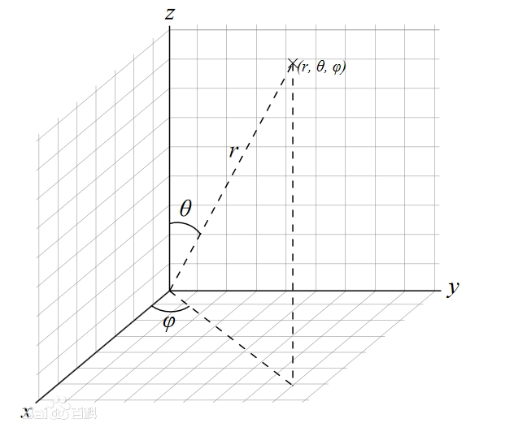

# 球函数

三大偏微分方程

- 拉普拉斯方程（椭圆）
- 热方程（抛物线）
- 波方程（双曲线）

### 常微分方程

含有未知函数的导数（含高阶导数）或微分的等式，称为**微分方程**

若未知函数是一元函数，则该函数为**常微分方程**

若导数的阶数为1，那么称为**一阶微分方程**

### 球坐标系

讨论常微分方程时，边界是记为重要的，而当边界是球形时，球坐标系会更好用

直角坐标系上点$P(x,y,z)$，也可以用三个有次序的数$(r,\theta,\varphi)$表示
$$
\begin{cases}
x=r \sin \theta \cos \varphi \\
y=r \sin \theta \sin \varphi \\
z=r\cos \theta
\end{cases}
$$

$$
\begin{cases}
r=\sqrt{x^2+y^2+z^2} \\
\theta=\arccos \frac{z}{r}	\\
\varphi=\arctan \frac{y}{x}
\end{cases}
$$

### 拉普拉斯方程

#### 拉普拉斯算符

多元函数用梯度表示不同方向函数值变化的速度，拉普拉斯算符$\nabla$就是对多元函数求梯度

对梯度再次做拉普拉斯算符$\nabla ^2$，就是求**梯度的散度**

在直角坐标系下，二阶拉普拉斯算符为
$$
\nabla^2=\frac{\partial ^2}{\partial x^2}+\frac{\partial ^2}{\partial y^2}+\frac{\partial ^2}{\partial z^2}
$$
在球坐标下，二阶拉普拉斯算法为（将xyz带入，化简得到）
$$
\nabla^2=\frac{1}{r^2}\frac{\partial}{\partial r}(r^2\frac{\partial}{\partial r})
+\frac{1}{r^2\sin \theta }\frac{\partial}{\partial \theta}(\sin \theta \frac{\partial}{\partial \theta})
+\frac{1}{r^2\sin^2 \theta }\frac{\partial^2}{\partial \varphi^2}
$$
#### 拉普拉斯方程

**拉普拉斯方程**$\nabla^2 u=0$，表示的物理含义是：在各个方向上（比如二维直角坐标系，就是x和y方向）加速度合为0

这意味着什么？一个不与外界进行能量交换的系统，其拉普拉斯方程为0

- 一个不受外力的系统，其整体加速度为0
- 一个不与外界传热的系统，其整体能量传播为0
- 一个理想的简谐振动
- 闭合磁场、电场

我们称拉普拉斯方程为0的函数叫做**Harmonic**

#### 球坐标系下的拉普拉斯方程

函数$u(r,\theta,\varphi)$的拉普拉斯方程为
$$
\nabla^2u=\frac{1}{r^2}\frac{\partial}{\partial r}(r^2\frac{\partial u}{\partial r})
+\frac{1}{r^2\sin \theta }\frac{\partial}{\partial \theta}(\sin \theta \frac{\partial u}{\partial \theta})
+\frac{1}{r^2\sin^2 \theta }\frac{\partial^2 u}{\partial \varphi^2}=0
$$
我们将距离和方向分离，得到
$$
u(r,\theta,\varphi)=R(r)Y(\theta,\varphi)
$$

- $R(r)$表示距离
- $Y(\theta,\varphi)$表示方向，被称为球函数

带入可得
$$
\frac{Y}{r^2}\frac{\mathrm{d}}{\mathrm{d} r}(r^2\frac{\mathrm{d} R}{\mathrm{d} r})
+\frac{R}{r^2\sin \theta }\frac{\partial}{\partial \theta}(\sin \theta \frac{\partial Y}{\partial \theta})
+\frac{R}{r^2\sin^2 \theta }\frac{\partial^2 Y}{\partial \varphi^2}=0
$$
移项、化简可得
$$
\frac{1}{R}\frac{\mathrm{d}}{\mathrm{d} r}(r^2\frac{\mathrm{d} R}{\mathrm{d} r})
=-\frac{1}{\sin \theta Y}\frac{\partial}{\partial \theta}(\sin \theta \frac{\partial Y}{\partial \theta})
-\frac{1}{Y}\frac{1}{\sin^2 \theta }\frac{\partial^2 Y}{\partial \varphi^2}
$$
我们发现，这个方程左边是与$R$有关的函数，右边是与$\theta,\varphi$有关的函数，显然两者不可能相等，除非他们同时等于一个常数

我们令这个常数为$l(l+1)$，于是得到两个方程
$$
\frac{\mathrm{d}}{\mathrm{d} r}(r^2\frac{\mathrm{d} R}{\mathrm{d} r})-l(l+1)R=0
$$

$$
\frac{1}{\sin \theta }\frac{\partial}{\partial \theta}(\sin \theta \frac{\partial Y}{\partial \theta})
+\frac{1}{\sin^2 \theta }\frac{\partial^2 Y}{\partial \varphi^2}
+l(l+1)Y=0
$$

第二个方程叫做**球函数方程**

如果我们进一步分离变量，令
$$
Y(\theta,\varphi)=\Theta(\theta)\Phi(\varphi)
$$
带入球函数方程，化简得到两个常微分方程
$$
\Phi''+\lambda \Phi=0
$$

$$
\sin \theta \frac{\mathrm{d}}{\mathrm{d} \theta}(\sin \theta \frac{\mathrm{d \Theta}}{\mathrm{d} \theta})+[l(l+1)\sin^2\theta-\lambda]\Theta=0
$$

#### 连带勒让德方程

上一步我们得到了两个常微分方程，第一个方程和**自然周期条件**构成本征值问题，在经过很多步的推导化简（感觉这些内容对我来说有些超纲），可以把第二个式子改写为
$$
(1-x^2)\frac{\mathrm{d}^2\Theta}{\mathrm{d}x^2}-2x\frac{\mathrm{d}\Theta}{\mathrm{d}x}+[l(l+1)-\frac{m^2}{1-x^2}]\Theta=0
$$
这个式子被称为$l$阶**连带勒让德方程**

这个式子的解，即函数$\Theta$的表达式为**连带勒让德函数**

### 级数解法

用球坐标系对拉普拉斯方程进行分离变数，得到了连带勒让德方程等特殊的函数方程，这些方程大多都是线性二阶常微分方程，很难用常规办法解，但可以用**级数解法**解出

#### 常点与奇点

对于一个复变函数的线性二阶常微分方程
$$
\frac{\mathrm{d}^2w}{\mathrm{d}z^2}+p(z)\frac{\mathrm{d}w}{\mathrm{d}z}+q(z)w=0
$$
若系数函数$p(z)$、$q(z)$在点$z_0$的邻域中是解析的，则点$z_0$叫做该方程的**常点**，若点$z_0$是奇点，则点$z_0$叫做该方程的**奇点**

